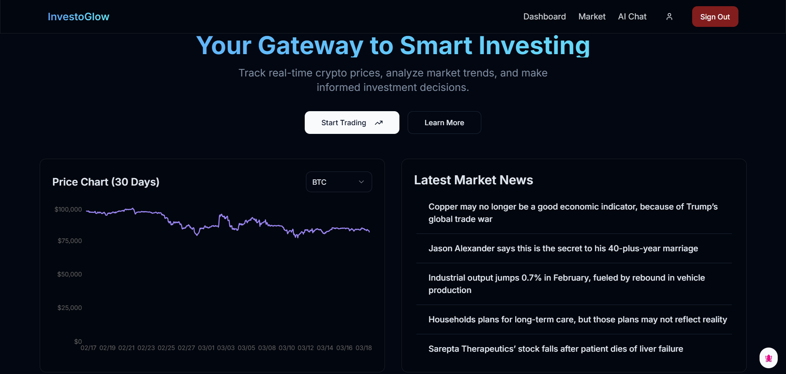

<h1>Investo Glow</h1>
    

 

**Investo Glow**, An application that provides investment insights by summarizing recent market trends, explaining financial terms. User queries are answered based on real-time data using AI agent service. Showing the stock markets and providing insights on the same. The application also provides a platform for users to discuss their investment strategies.

## Tech Stack

| Logo                                                 | Technology                                        | Description                                                                                  |
| ---------------------------------------------------- | ------------------------------------------------- | -------------------------------------------------------------------------------------------- |
|      | **[TypeScript](https://www.typescriptlang.org/)** | Strongly typed programming language for enhanced development                                 |
|       | **[Vite.js](https://nextjs.org/)**                | Vite is a blazing fast frontend build tool powering the next generation of web applications. |
|        | **[React](https://react.dev/)**                   | The library for web and native user interfaces                                               |
|  | **[Tailwind](https://tailwindcss.com/)**          | Utility-first CSS framework for modern designs                                               |
|      | **[Vercel](https://vercel.com/home)**             | Platform for deploying and hosting web applications                                          |
|                          | **[Shadcn](https://ui.shadcn.com/)**              | A set of beautifully-designed, accessible components and a code distribution platform        |

