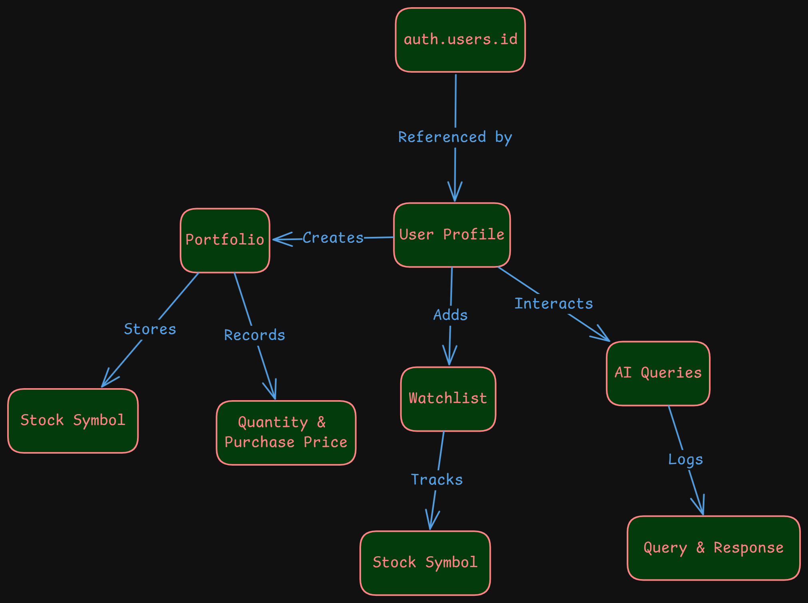
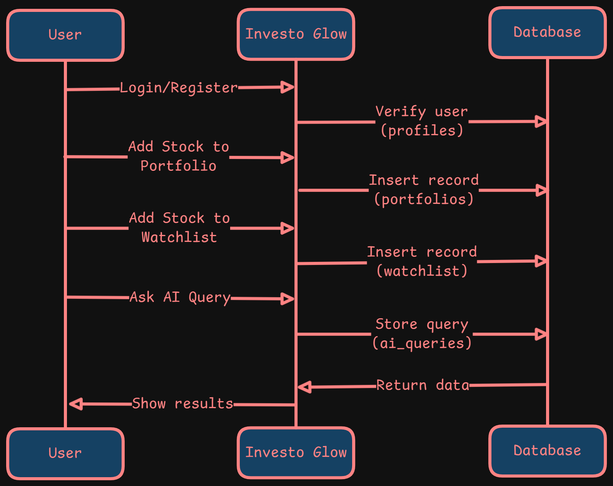
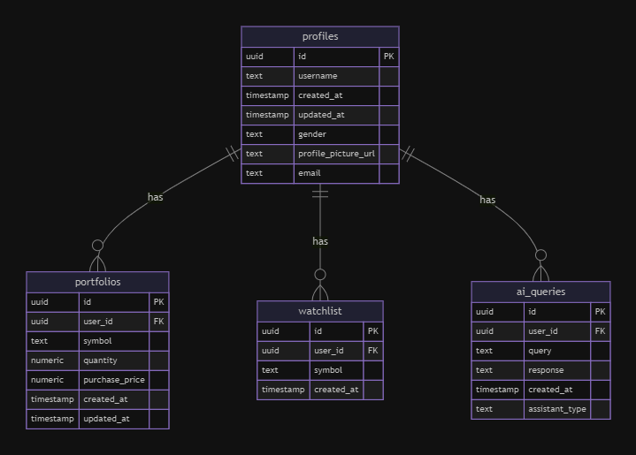

<div align="center">
    <h1><u>Investo Glow</u></h1>
</div>

<div align="center">
    
    <p>
        <strong>Your AI-Powered Investment Companion</strong>
    </p>
    <p style="font-size: 1.2rem; font-weight: semi-bold;">
        <a href="#features" style="text-decoration: underline;">Features</a> •
        <a href="#tech-stack" style="text-decoration: underline;">Tech Stack</a> •
        <a href="#design" style="text-decoration: underline;">Design</a> •
        <a href="#getting-started" style="text-decoration: underline;">Getting Started</a> •
        <a href="#contributing" style="text-decoration: underline;">Contributing</a> •
        <a href="#team" style="text-decoration: underline;">Team</a>
    </p>
</div>

## Features

- 🤖 **AI-Powered Insights**: Get real-time investment insights and market analysis powered by advanced AI
- 📊 **Market Trends**: Stay updated with comprehensive market trend summaries and analysis
- 📈 **Stock Market Tracking**: Real-time stock market data and personalized insights
- 🔍 **Smart Query System**: Get instant answers to your investment-related questions

## Tech Stack

| Technology | Link | Description |
|------------|------|-------------|
| | **[TypeScript](https://www.typescriptlang.org/)** | Strongly typed programming language for enhanced development |
|  | **[Vite.js](https://vitejs.dev/)** | Blazing fast frontend build tool for modern web applications |
|  | **[React](https://react.dev/)** | Library for building user interfaces |
|  | **[Tailwind](https://tailwindcss.com/)** | Utility-first CSS framework for modern designs |
|  | **[Vercel](https://vercel.com/home)** | Platform for deploying and hosting web applications |
|  | **[Shadcn](https://ui.shadcn.com/)** | Beautiful, accessible UI components |
| | **[Supabase](https://supabase.com/)** | Open-source Firebase alternative for database and authentication |

## Design

The design of our SaaS application uses the `auth.users.id` to store the user's data. The flowchart below shows the relationship between the user, the portfolio, the watchlist, and the AI queries.

<div align="center">
    
</div>

The proper sequence of the application can be presented as:

<div align="center">
    
</div>


### Database

The database is a PostgreSQL database that is hosted on Supabase. The flowchart below shows the relationship between the user, the portfolio, the watchlist, and the AI queries.

<div align="center">
    
</div>

## Getting Started

### Prerequisites

- Node.js (v16 or higher)
- npm or yarn

### Installation

1. Clone the repository

```bash
git clone https://github.com/yashksaini-coder/investo-glow.git
```

2. Install dependencies

```bash
cd investo-glow
npm install
# or
yarn install
```

3. Start the development server

```bash
npm run dev
# or
yarn dev
```

4. Open [http://localhost:5173](http://localhost:5173) in your browser

## Contributing

We welcome contributions! Please feel free to submit a Pull Request. For major changes, please open an issue first to discuss what you would like to change.

1. Fork the repository
2. Create your feature branch (`git checkout -b feature/AmazingFeature`)
3. Commit your changes (`git commit -m 'Add some AmazingFeature'`)
4. Push to the branch (`git push origin feature/AmazingFeature`)
5. Open a Pull Request

## Acknowledgments

- Thanks to all contributors who have helped shape Investo Glow
- Special thanks to the open-source community for the amazing tools and libraries

---

## Team

<div align="center">
    
<table>
    <tbody>
        <tr>
            <td align="center" width="33.33%">
                
                <br/>
                <h4 align="center">
                    <b>Tannu Chaudhary</b>
                </h4>
                <div align="center">
                    <p>UI/UX Designer</p>
                    <a href="https://linkedin.com/in/tannuchaudhary"></a>
                    <a href="https://twitter.com/tannuchaudhary"></a>
                    <a href="https://github.com/tannuiscoding"></a>
                </div>
            </td>
            <td align="center" width="33.33%">
                
                <br/>
                <h4 align="center">
                    <b>Yash K. Saini</b>
                </h4>
                <div align="center">
                    <p>Lead Developer</p>
                    <a href="https://linkedin.com/in/yashksaini"></a>
                    <a href="https://twitter.com/yash_k_saini"></a>
                    <a href="https://github.com/yashksaini-coder"></a>
                </div>
            </td>
            <td align="center" width="33.33%">
                
                <br/>
                <h4 align="center">
                    <b>Kushagra Singhal</b>
                </h4>
                <div align="center">
                    <p>Senior Backend Engineer</p>
                    <a href="https://linkedin.com/in/kushagra-singhal-181576224"></a>
                    <a href="https://github.com/kushagra21-afk"></a>
                </div>
            </td>
        </tr>
    </tbody>
</table>

</div>
<div align="center">
    <p>
        <strong>Made with ❤️ and ☕ by the Investo Glow Team</strong>
    </p>
</div>
